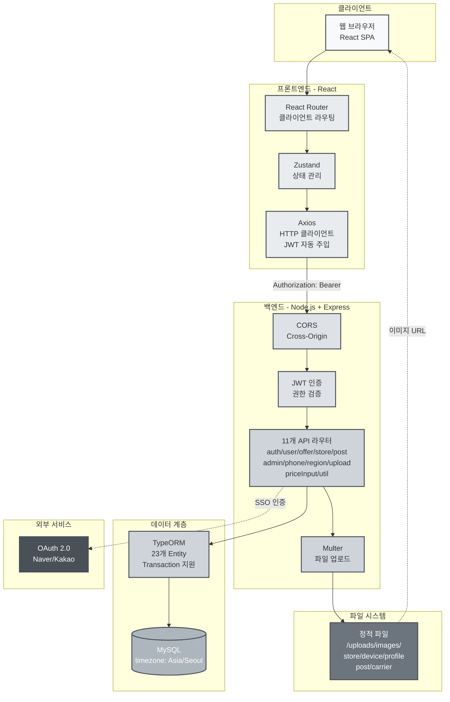
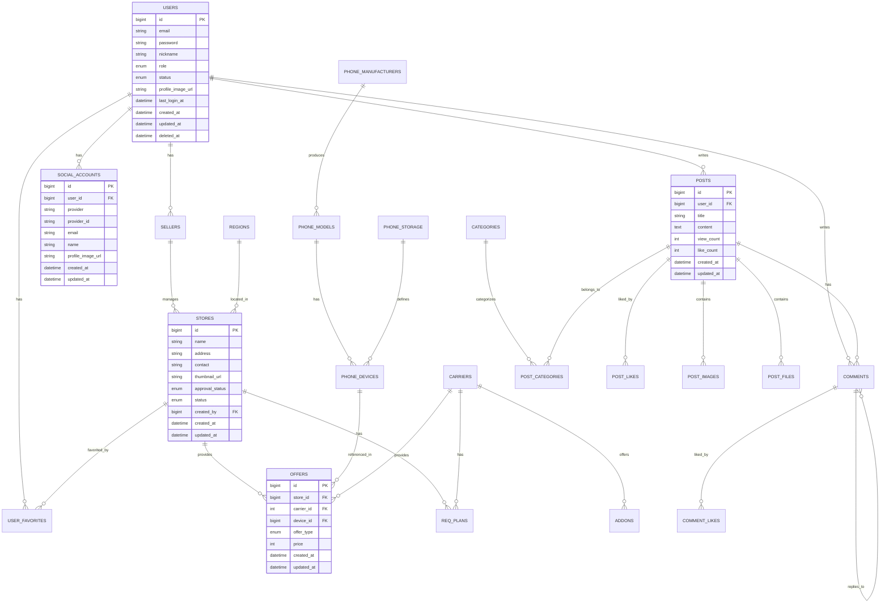

# 📱 PhoneLink - 스마트폰 가격 비교 플랫폼

<div align="center">
  
  
  
  
  
  
</div>

## 🎯 프로젝트 개요

### 📈 시장 변화

2025년 7월 22일, 단통법이 폐지되어 휴대폰 보조금 경쟁이 다시 시작되었습니다. 과거 단통법 시절에는 '뽐뿌', '알고사', '네이버 밴드' 등 소수 커뮤니티에서만 '성지'라 불리는 곳의 보조금 정보가 음성적으로 공유되었습니다.

### 🎯 해결하고자 하는 문제

보조금은 합법화되었지만, 정보는 여전히 각 판매점에 흩어져 있습니다. 소비자는 발품을 팔아야만 최저가를 찾을 수 있는 **'정보의 파편화'** 문제가 발생했습니다.

### 💡 PhoneLink의 솔루션

**PhoneLink**는 이러한 정보의 파편화 문제를 해결하는 B2B2C 플랫폼입니다. 소비자는 최적의 가격을 쉽게 찾을 수 있고, 판매자는 경쟁력 있는 가격을 제시할 수 있으며, 관리자는 전체 생태계를 효율적으로 관리할 수 있습니다.

#### 소비자를 위한 가치

- **시간 절약**: 한 번의 검색으로 최적의 구매처 발견
- **합리적인 구매**: 전국 휴대폰 가격 정보를 쉽고 투명하게 비교하여 호갱 당하지 않는 합리적 구매
- **신뢰할 수 있는 거래**: 검증된 판매자 정보로 안전한 거래 환경 제공
- **커뮤니티 기반 집단지성**: 사용자 경험 공유를 통한 집단지성 활용

#### 판매자를 위한 가치

- **효율적인 마케팅**: 플랫폼 노출을 통한 고객 유입
- **간편한 시세 관리**: 직관적인 UI로 빠른 시세 정보 업데이트
- **경쟁력 강화**: 가격 경쟁력에 집중할 수 있는 환경 제공

## 🏗️ 시스템 아키텍처



## 🚀 핵심 기능

### 1. 📊 가격 비교

- 복합 조건 검색 (제조사, 모델, 용량, 통신사, 지역)
- 조건별 상세 정보 제공 (출고가, 자급제 가격, 요금제 정보)
- 무한 스크롤 페이지네이션 (Intersection Observer API)

### 2. 🏪 매장 관리 시스템

- **매장 등록**: 사업자 정보, 위치, 영업시간, 연락처 등록
- **기기별 가격 관리**: Excel 대량 업로드, 개별 가격 등록/수정
- **요금제 관리**: 통신사별 필수 요금제 및 월 납입금 설정
- **부가서비스 관리**: 부가서비스 등록 및 의무 기간 관리
- **직원 관리**: SELLER 역할 기반 매장 접근 제어

### 3. 👥 관리자 시스템

- **매장 승인 관리**: 매장 등록 승인/반려 처리
- **마스터 데이터 관리**: 제조사, 모델, 통신사, 지역, 카테고리 CRUD
- **사용자 관리**: 사용자 조회, 정지/해제, 권한 관리

### 4. 🎨 사용자 경험

- **다크모드 지원**: Context API 기반 라이트/다크 테마 전환
- **반응형 디자인**: Tailwind CSS를 활용한 다양한 디바이스 지원
- **직관적 UI/UX**: 역할별 맞춤 네비게이션 및 알림 시스템

## 🛠️ 기술 스택

### Frontend

- **React** - 컴포넌트 기반 UI 개발
- **TypeScript** - 타입 안정성 및 개발 생산성
- **Vite** - 빠른 개발 서버 및 빌드 도구
- **Tailwind CSS** - 유틸리티 우선 CSS 프레임워크
- **Zustand** - 경량 상태 관리 라이브러리
- **React Router** - SPA 라우팅
- **Axios** - HTTP 클라이언트

### Backend

- **Node.js** - 서버 런타임
- **Express** - 웹 프레임워크
- **TypeScript** - 타입 안정성
- **TypeORM** - ORM 및 데이터베이스 관리
- **MySQL** - 관계형 데이터베이스
- **JWT** - 인증 토큰 관리

## 📊 데이터베이스 설계



## 🚀 실행 방법

### 1. 프로젝트 클론 및 의존성 설치

```bash
# 프로젝트 클론
git clone https://github.com/HyunZai/phone-link.git
cd phone-link

# 의존성 설치
sh pull-and-install-deps.sh
```

### 2. 환경 변수 설정

**Frontend** (`frontend/.env`):

```env
VITE_API_URL=http://localhost:4000
```

**Backend** (`backend/.env`):

```env
PORT=4000

# Database Connection
DATABASE_HOST=your_db_host
DATABASE_PORT=your_db_port
DATABASE_USER=your_db_user
DATABASE_PASSWORD=your_db_password
DATABASE_NAME=phonelink

# JWT Secret
JWT_SECRET=your_jwt_secret

# SSO Configuration
GOOGLE_CLIENT_ID=your_google_client_id
GOOGLE_CLIENT_SECRET=your_google_client_secret
KAKAO_CLIENT_ID=your_kakao_client_id
KAKAO_CLIENT_SECRET=your_kakao_client_secret
NAVER_CLIENT_ID=your_naver_client_id
NAVER_CLIENT_SECRET=your_naver_client_secret
```

### 3. 개발 서버 실행

```bash
# 프론트엔드 + 백엔드 동시 실행
npm run dev

# 또는 개별 실행
cd frontend && npm run dev  # http://localhost:5173
cd backend && npm run dev   # http://localhost:4000
```

### 4. 프로덕션 빌드

```bash
npm run build
```

## 📄 라이선스

이 프로젝트는 MIT 라이선스 하에 배포됩니다. 자세한 내용은 [LICENSE](LICENSE) 파일을 참조하세요.

## 📞 연락처

**Email:** khj980211@naver.com  
**프로젝트 링크:** [https://github.com/HyunZai/phone-link](https://github.com/HyunZai/phone-link)

---

<div align="center">
  <p>Made by <a href="https://github.com/HyunZai">HyunZai</a> & <a href="https://github.com/bonzonkim">bonzonkim</a></p>
</div>
