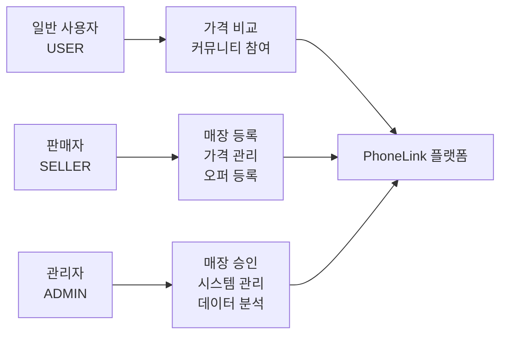
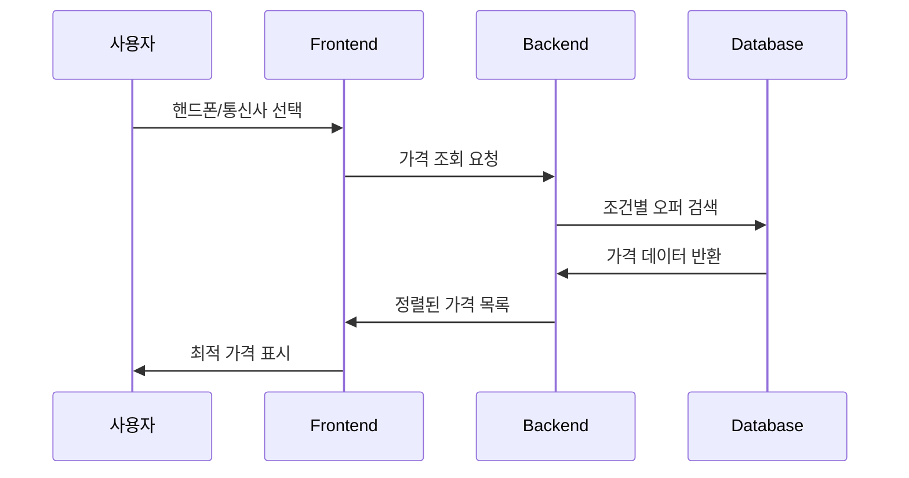
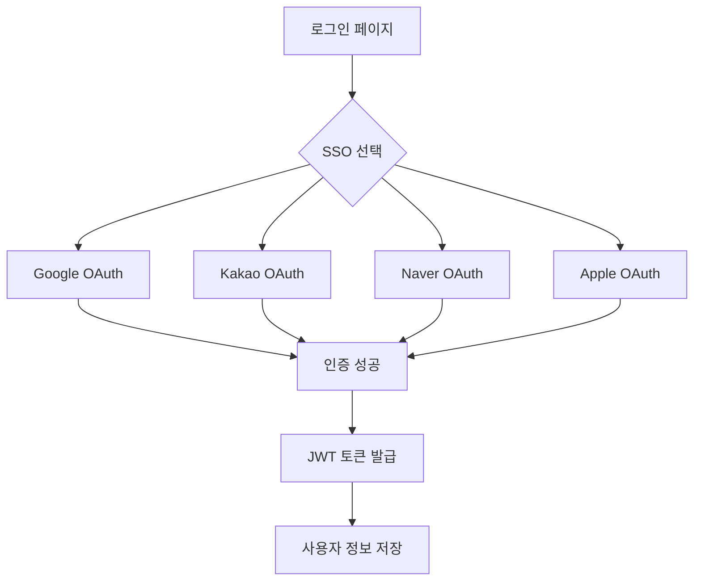
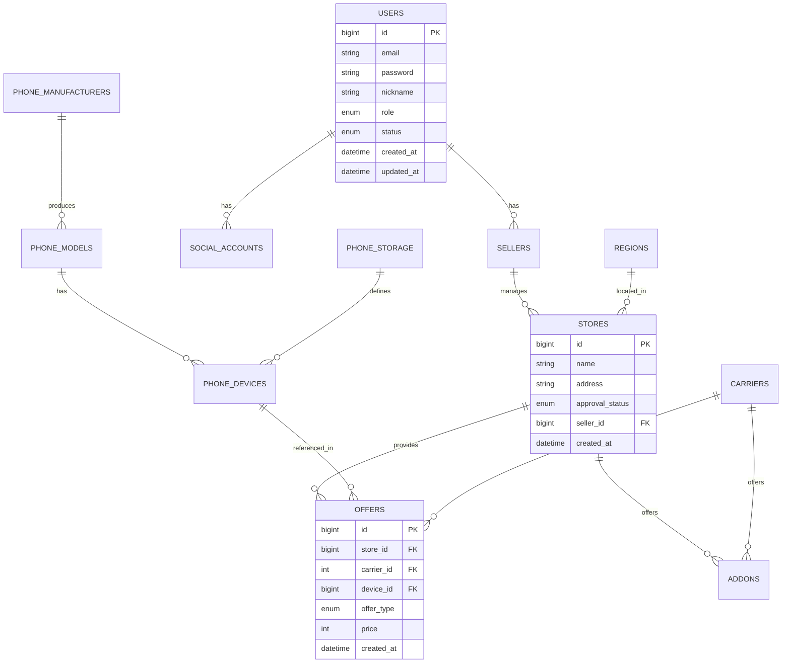
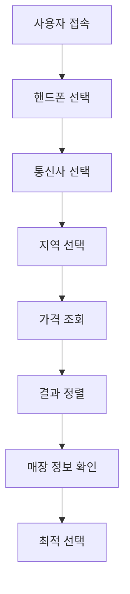
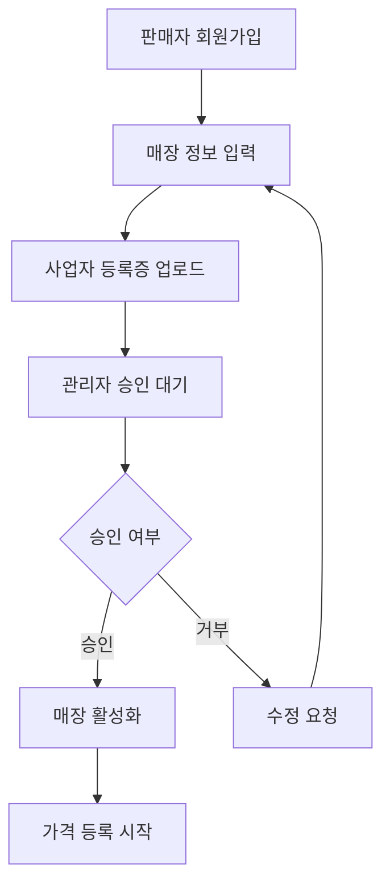
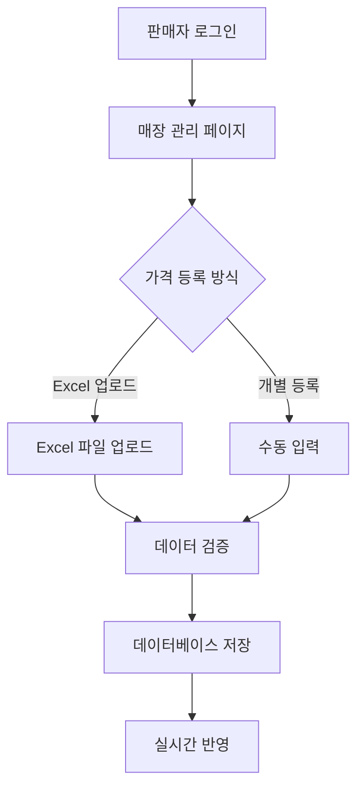

# 📱 PhoneLink - 스마트폰 가격 비교 플랫폼

<div align="center">
  
  
  
  
  
  
</div>

## 🎯 프로젝트 개요

**PhoneLink**는 스마트폰 구매 시 다양한 매장의 가격을 실시간으로 비교할 수 있는 B2B2C 플랫폼입니다.
소비자는 최적의 가격을 찾을 수 있고, 판매자는 경쟁력 있는 가격을 제시할 수 있으며, 관리자는 전체 생태계를 관리할 수 있습니다.

### 🏢 비즈니스 모델

- **B2B2C 플랫폼**: 매장(판매자) ↔ 플랫폼 ↔ 소비자
- **가격 투명성**: 실시간 가격 비교로 시장 경쟁 촉진
- **데이터 기반 의사결정**: 가격 트렌드 및 시장 분석 제공

## 🏗️ 시스템 아키텍처

```mermaid
graph TB
    subgraph "Frontend (React + TypeScript)"
        A[사용자 인터페이스]
        B[상태 관리 - Zustand]
        C[라우팅 - React Router]
        D[UI 컴포넌트 - Tailwind CSS]
    end

    subgraph "Backend (Node.js + Express)"
        E[REST API]
        F[인증/인가 미들웨어]
        G[비즈니스 로직]
        H[데이터 검증]
    end

    subgraph "Database (MySQL)"
        I[사용자 데이터]
        J[매장/오퍼 데이터]
        K[핸드폰 카탈로그]
        L[지역/통신사 데이터]
    end

    subgraph "External Services"
        M[SSO (Google, Kakao, Naver, Apple)]
        N[주소 검색 API]
        O[파일 업로드]
    end

    A --> E
    B --> E
    C --> E
    D --> E

    E --> F
    F --> G
    G --> H
    H --> I
    H --> J
    H --> K
    H --> L

    F --> M
    G --> N
    G --> O
```

## 👥 사용자 역할 및 권한



### 🔐 권한 체계

- **USER**: 가격 조회, 커뮤니티 참여, 개인정보 관리
- **SELLER**: 매장 등록/관리, 가격 등록/수정, 판매 통계
- **ADMIN**: 매장 승인/거부, 사용자 관리, 시스템 설정

## 🚀 핵심 기능

### 1. 📊 실시간 가격 비교 시스템



**기술적 특징:**

- 복합 조건 검색 (제조사, 모델, 용량, 통신사, 지역)
- 실시간 가격 정렬 및 필터링
- 번호이동(MNP) / 기기변경(CHG) 구분

### 2. 🏪 매장 관리 시스템

- **매장 등록**: 사업자 정보, 위치, 영업시간 등록
- **가격 관리**: Excel 업로드, 개별 가격 등록/수정
- **부가서비스**: 통신사별 부가서비스 및 요금제 관리
- **승인 시스템**: 관리자 승인 후 서비스 활성화

### 3. 🔐 다중 SSO 인증



### 4. 📱 반응형 UI/UX

- **다크/라이트 모드**: 사용자 선호도에 따른 테마 전환
- **모바일 최적화**: Tailwind CSS를 활용한 반응형 디자인
- **직관적 네비게이션**: 역할별 맞춤 메뉴 구성

## 🛠️ 기술 스택

### Frontend

- **React 18.2.0** - 컴포넌트 기반 UI 개발
- **TypeScript** - 타입 안정성 및 개발 생산성
- **Vite** - 빠른 개발 서버 및 빌드 도구
- **Tailwind CSS** - 유틸리티 우선 CSS 프레임워크
- **Zustand** - 경량 상태 관리 라이브러리
- **React Router** - SPA 라우팅
- **Axios** - HTTP 클라이언트
- **React Spinners** - 로딩 UI 컴포넌트

### Backend

- **Node.js 18+** - 서버 런타임
- **Express 5.1.0** - 웹 프레임워크
- **TypeScript** - 타입 안정성
- **TypeORM 0.3.25** - ORM 및 데이터베이스 관리
- **MySQL 8.0** - 관계형 데이터베이스
- **JWT** - 인증 토큰 관리
- **Multer** - 파일 업로드 처리
- **Bcrypt** - 비밀번호 암호화

### DevOps & Tools

- **Concurrently** - 동시 개발 서버 실행
- **ESLint** - 코드 품질 관리
- **Prettier** - 코드 포맷팅
- **Docker** - 컨테이너화 (Dockerfile 포함)

## 📊 데이터베이스 설계



## 🔄 비즈니스 프로세스

### 1. 사용자 가격 비교 프로세스



### 2. 판매자 매장 등록 프로세스



### 3. 가격 등록 프로세스



## 🚀 실행 방법

### 1. 프로젝트 클론 및 의존성 설치

```bash
# 프로젝트 클론
git clone https://github.com/HyunZai/phone-link.git
cd phone-link

# 의존성 설치
sh pull-and-install-deps.sh
```

### 2. 환경 변수 설정

**Frontend** (`frontend/.env`):

```env
VITE_API_URL=http://localhost:4000
```

**Backend** (`backend/.env`):

```env
PORT=4000

# Database Connection
DATABASE_HOST=your_db_host
DATABASE_PORT=your_db_port
DATABASE_USER=your_db_user
DATABASE_PASSWORD=your_db_password
DATABASE_NAME=phonelink

# JWT Secret
JWT_SECRET=your_jwt_secret

# SSO Configuration
GOOGLE_CLIENT_ID=your_google_client_id
GOOGLE_CLIENT_SECRET=your_google_client_secret
KAKAO_CLIENT_ID=your_kakao_client_id
KAKAO_CLIENT_SECRET=your_kakao_client_secret
NAVER_CLIENT_ID=your_naver_client_id
NAVER_CLIENT_SECRET=your_naver_client_secret
```

### 3. 개발 서버 실행

```bash
# 프론트엔드 + 백엔드 동시 실행
npm run dev

# 또는 개별 실행
cd frontend && npm run dev  # http://localhost:5173
cd backend && npm run dev   # http://localhost:4000
```

### 4. 프로덕션 빌드

```bash
npm run build
```

## 📈 성능 최적화

### Frontend

- **코드 스플리팅**: React.lazy를 활용한 지연 로딩
- **이미지 최적화**: WebP 포맷 및 지연 로딩
- **상태 관리 최적화**: Zustand를 활용한 선택적 리렌더링
- **번들 최적화**: Vite의 자동 트리 셰이킹

### Backend

- **데이터베이스 인덱싱**: 자주 조회되는 컬럼에 인덱스 설정
- **쿼리 최적화**: TypeORM QueryBuilder를 활용한 효율적 쿼리
- **캐싱 전략**: Redis를 활용한 세션 및 데이터 캐싱 (향후 구현)
- **API 응답 최적화**: 필요한 데이터만 선택적 조회

## 🔒 보안 고려사항

- **JWT 토큰**: 만료 시간 설정 및 리프레시 토큰 구현
- **비밀번호 암호화**: Bcrypt를 활용한 해시 암호화
- **SQL 인젝션 방지**: TypeORM의 파라미터화된 쿼리 사용
- **CORS 설정**: 허용된 도메인만 API 접근 가능
- **파일 업로드 보안**: 파일 타입 및 크기 제한

## 🎯 향후 개발 계획

### Phase 1: 핵심 기능 강화

- [ ] 실시간 알림 시스템 (WebSocket)
- [ ] 고급 필터링 및 검색 기능
- [ ] 가격 히스토리 및 트렌드 분석

### Phase 2: 사용자 경험 개선

- [ ] 모바일 앱 (React Native)
- [ ] AI 기반 가격 추천 시스템
- [ ] 소셜 로그인 확장 (Apple, Facebook)

### Phase 3: 비즈니스 확장

- [ ] 결제 시스템 연동
- [ ] 리뷰 및 평점 시스템
- [ ] 마케팅 도구 및 분석 대시보드

## 📝 API 문서

### 주요 엔드포인트

#### 인증

- `POST /auth/login` - 로그인
- `POST /auth/signup` - 회원가입
- `GET /auth/callback/:provider` - SSO 콜백

#### 가격 조회

- `GET /offers` - 가격 목록 조회
- `GET /offers/compare` - 가격 비교

#### 매장 관리

- `POST /stores` - 매장 등록
- `PUT /stores/:id` - 매장 정보 수정
- `POST /stores/:id/offers` - 가격 등록

#### 관리자

- `GET /admin/stores/pending` - 승인 대기 매장
- `PUT /admin/stores/:id/approve` - 매장 승인

## 🤝 기여하기

1. Fork the Project
2. Create your Feature Branch (`git checkout -b feature/AmazingFeature`)
3. Commit your Changes (`git commit -m 'Add some AmazingFeature'`)
4. Push to the Branch (`git push origin feature/AmazingFeature`)
5. Open a Pull Request

## 📄 라이선스

이 프로젝트는 MIT 라이선스 하에 배포됩니다. 자세한 내용은 [LICENSE](LICENSE) 파일을 참조하세요.

## 📞 연락처

프로젝트 링크: [https://github.com/HyunZai/phone-link](https://github.com/HyunZai/phone-link)

---

<div align="center">
  <p>Made with ❤️ by HyunZai</p>
  <p>📱 스마트폰 가격 비교의 새로운 기준, PhoneLink</p>
</div>
