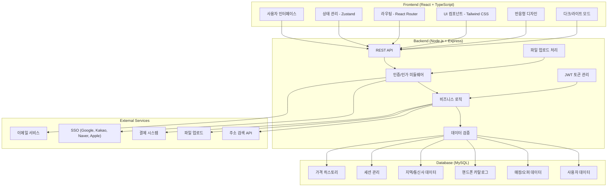
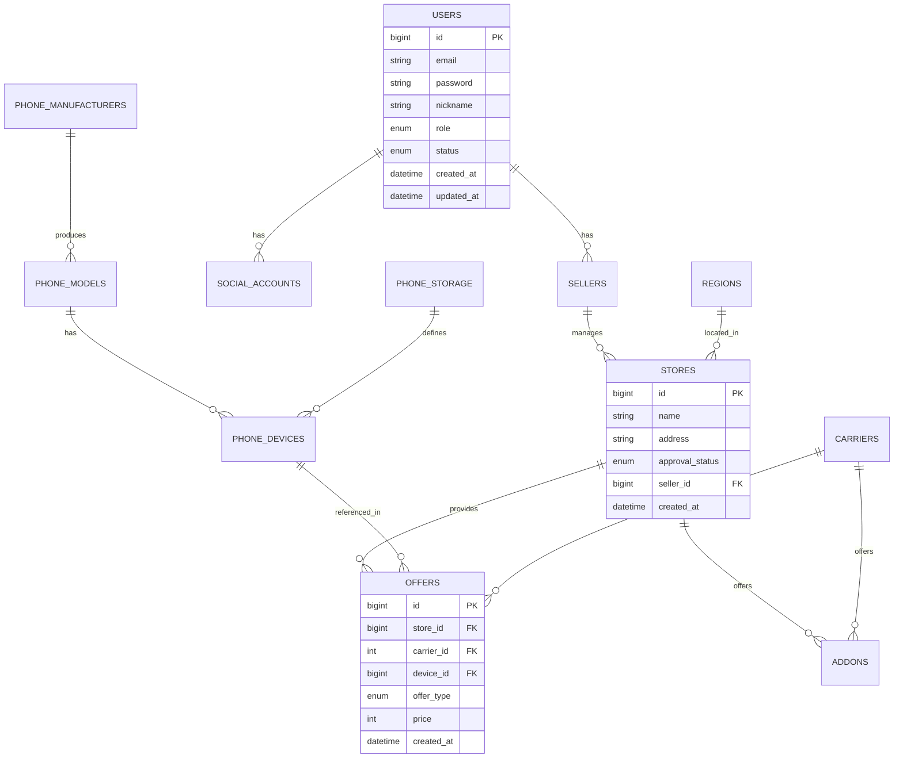

# 📱 PhoneLink - 스마트폰 가격 비교 플랫폼

<div align="center">
  
  
  
  
  
  
</div>

## 🎯 프로젝트 개요

**PhoneLink**는 스마트폰 구매 시 다양한 매장의 가격을 비교할 수 있는 B2B2C 플랫폼입니다.
소비자는 최적의 가격을 찾을 수 있고, 판매자는 경쟁력 있는 가격을 제시할 수 있으며, 관리자는 전체 생태계를 관리할 수 있습니다.

### 🏢 비즈니스 모델

- **B2B2C 플랫폼**: 매장(판매자) ↔ 플랫폼 ↔ 소비자
- **광고 수익**: 매장 프로모션 및 배너 광고를 통한 수익 창출

## 🏗️ 시스템 아키텍처



## 🚀 핵심 기능

### 1. 📊 실시간 가격 비교 시스템

**기술적 특징:**

- 복합 조건 검색 (제조사, 모델, 용량, 통신사, 지역)
- 매장별 상세 정보 제공

### 2. 🏪 매장 관리 시스템

- **매장 등록**: 사업자 정보, 위치, 영업시간 등록
- **가격 관리**: Excel 업로드, 개별 가격 등록/수정
- **부가서비스**: 통신사별 부가서비스 및 요금제 관리
- **승인 시스템**: 관리자 승인 후 서비스 활성화

### 3. 📱 반응형 UI/UX

- **다크/라이트 모드**: 사용자 선호도에 따른 테마 전환
- **모바일 최적화**: Tailwind CSS를 활용한 반응형 디자인
- **직관적 네비게이션**: 역할별 맞춤 메뉴 구성

## 🛠️ 기술 스택

### Frontend

- **React 18.2.0** - 컴포넌트 기반 UI 개발
- **TypeScript** - 타입 안정성 및 개발 생산성
- **Vite** - 빠른 개발 서버 및 빌드 도구
- **Tailwind CSS** - 유틸리티 우선 CSS 프레임워크
- **Zustand** - 경량 상태 관리 라이브러리
- **React Router** - SPA 라우팅
- **Axios** - HTTP 클라이언트

### Backend

- **Node.js 18+** - 서버 런타임
- **Express 5.1.0** - 웹 프레임워크
- **TypeScript** - 타입 안정성
- **TypeORM 0.3.25** - ORM 및 데이터베이스 관리
- **MySQL 8.0** - 관계형 데이터베이스
- **JWT** - 인증 토큰 관리

## 📊 데이터베이스 설계



## 🚀 실행 방법

### 1. 프로젝트 클론 및 의존성 설치

```bash
# 프로젝트 클론
git clone https://github.com/HyunZai/phone-link.git
cd phone-link

# 의존성 설치
sh pull-and-install-deps.sh
```

### 2. 환경 변수 설정

**Frontend** (`frontend/.env`):

```env
VITE_API_URL=http://localhost:4000
```

**Backend** (`backend/.env`):

```env
PORT=4000

# Database Connection
DATABASE_HOST=your_db_host
DATABASE_PORT=your_db_port
DATABASE_USER=your_db_user
DATABASE_PASSWORD=your_db_password
DATABASE_NAME=phonelink

# JWT Secret
JWT_SECRET=your_jwt_secret

# SSO Configuration
GOOGLE_CLIENT_ID=your_google_client_id
GOOGLE_CLIENT_SECRET=your_google_client_secret
KAKAO_CLIENT_ID=your_kakao_client_id
KAKAO_CLIENT_SECRET=your_kakao_client_secret
NAVER_CLIENT_ID=your_naver_client_id
NAVER_CLIENT_SECRET=your_naver_client_secret
```

### 3. 개발 서버 실행

```bash
# 프론트엔드 + 백엔드 동시 실행
npm run dev

# 또는 개별 실행
cd frontend && npm run dev  # http://localhost:5173
cd backend && npm run dev   # http://localhost:4000
```

### 4. 프로덕션 빌드

```bash
npm run build
```

## 🎯 향후 개발 계획

### Phase 1: 핵심 기능 강화

- [ ] 실시간 알림 시스템 (WebSocket)
- [ ] 고급 필터링 및 검색 기능
- [ ] 가격 히스토리 및 트렌드 분석

### Phase 2: 사용자 경험 개선

- [ ] 모바일 앱 (React Native)
- [ ] AI 기반 가격 추천 시스템
- [ ] 소셜 로그인 확장 (Apple, Google)

### Phase 3: 비즈니스 확장

- [ ] 핸드폰 직접 판매
- [ ] 커뮤니티 확장

## 📄 라이선스

이 프로젝트는 MIT 라이선스 하에 배포됩니다. 자세한 내용은 [LICENSE](LICENSE) 파일을 참조하세요.

## 📞 연락처

프로젝트 링크: [https://github.com/HyunZai/phone-link](https://github.com/HyunZai/phone-link)

---

<div align="center">
  <p>Made by HyunZai</p>
  <p>📱 바가지는 그만! 스마트폰 가격 비교의 새로운 기준, PhoneLink</p>
</div>
